# Openfort-PlayFab Integration in Unity

## Overview
[PlayFab](https://playfab.com/) is a backend service provided by Microsoft for game developers, offering tools for live game management, all powered by Azure's cloud infrastructure.

In this integration, we use the [Google Play Games plugin for Unity](https://github.com/playgameservices/play-games-plugin-for-unity) to handle authentication with PlayFab, ensuring a seamless and secure login experience for users on Android devices.

By integrating the [Openfort SDK](https://github.com/openfort-xyz/openfort-node) into Azure Functions, we establish a seamless connection to PlayFab. Unity clients using the PlayFab Unity SDK can tap into these functions, accessing the full range of Openfort features within the game environment.

## Application Workflow

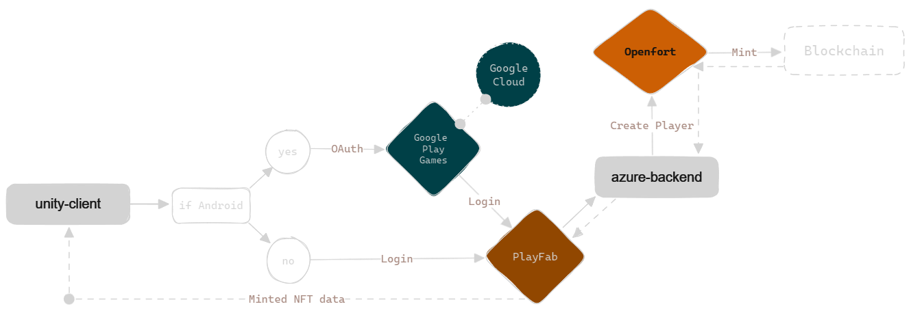

## Prerequisites
+ [Create a PlayFab account and title](https://learn.microsoft.com/en-us/gaming/playfab/gamemanager/quickstart)
+ Set up your Azure development environment:
    + [Configure your environment](https://learn.microsoft.com/en-us/azure/azure-functions/create-first-function-vs-code-node?pivots=nodejs-model-v4#configure-your-environment)
    + [Sign in to Azure](https://learn.microsoft.com/en-us/azure/azure-functions/create-first-function-vs-code-node?pivots=nodejs-model-v4#sign-in-to-azure)
    + [Create a function app](https://learn.microsoft.com/en-us/azure/azure-functions/create-first-function-vs-code-node?pivots=nodejs-model-v4#create-the-function-app-in-azure)
+ [Sign in to dashboard.openfort.xyz](http://dashboard.openfort.xyz) and create a new project
+ Download or clone the [sample project](https://github.com/dpradell-dev/openfort-playfab-unity-sample): 
    + Open [unity-client](https://github.com/dpradell-dev/openfort-playfab-unity-sample/tree/main/unity-client) with Unity
    + Open [azure-backend](https://github.com/dpradell-dev/openfort-playfab-unity-sample/tree/main/azure-backend) with VS Code
+ Watch the [video tutorial](https://www.youtube.com/watch?v=dbLpA2YB6vU) on configuring *Google Play Games for Unity* and apply it to [unity-client](https://github.com/dpradell-dev/openfort-playfab-unity-sample/tree/main/unity-client). Note that:
    + You need a [Google Play Developer account](https://support.google.com/googleplay/android-developer/answer/6112435?hl=en)
    + You need a [Google Cloud project](https://developers.google.com/workspace/guides/create-project)
    + Google Play Games SDK is already imported to [unity-client](https://github.com/dpradell-dev/openfort-playfab-unity-sample/tree/main/unity-client)
    + Skip the instructions related to ***Unity Gaming Services***
    + We provide a [Keystore](https://github.com/dpradell-dev/openfort-playfab-unity-sample/tree/main/unity-client/Keystore//TODOlink) (password: `android`). You can use it instead of [creating a new one](https://youtu.be/dbLpA2YB6vU?t=273)
    + Skip the step to [create this script](https://youtu.be/dbLpA2YB6vU?t=1089)

## Set up Openfort

1. #### [Add a Contract](https://dashboard.openfort.xyz/assets/new)
   This sample requires a contract to run. We use [0x38090d1636069c0ff1Af6bc1737Fb996B7f63AC0](https://mumbai.polygonscan.com/address/0x38090d1636069c0ff1Af6bc1737Fb996B7f63AC0) (NFT contract deployed in 80001 Mumbai). You can use this for the guide:

   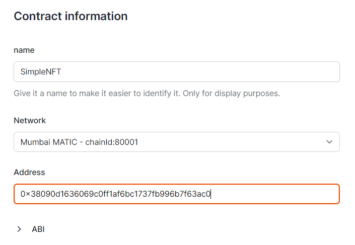

2. #### [Add a Policy](https://dashboard.openfort.xyz/policies/new)
   We aim to cover gas fees for users. Set a new gas policy:

   

   Now, add a rule so our contract uses this policy:

   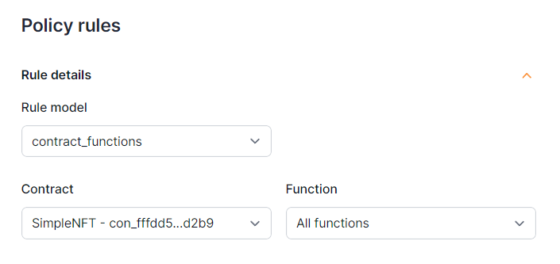

## Deploy Azure Backend
Open [azure-backend](https://github.com/dpradell-dev/openfort-playfab-unity-sample/tree/main/azure-backend) with VS Code and sign in to Azure:


Ensure your Function App (here, it's "openfort-playfab") is listed:


In the terminal, run:
```
npm install
```

In the explorer, right-click on a function and select ***Deploy to Function App***:

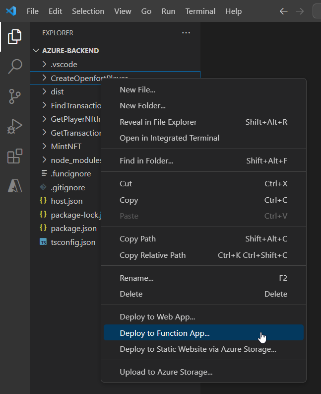

Next, choose your Function App:


Then, click on ***Deploy***:

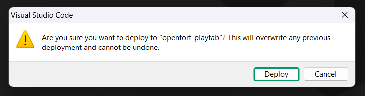

Navigate to your [Azure Portal](https://portal.azure.com/#home) and open your Function App. You should see all the functions listed:

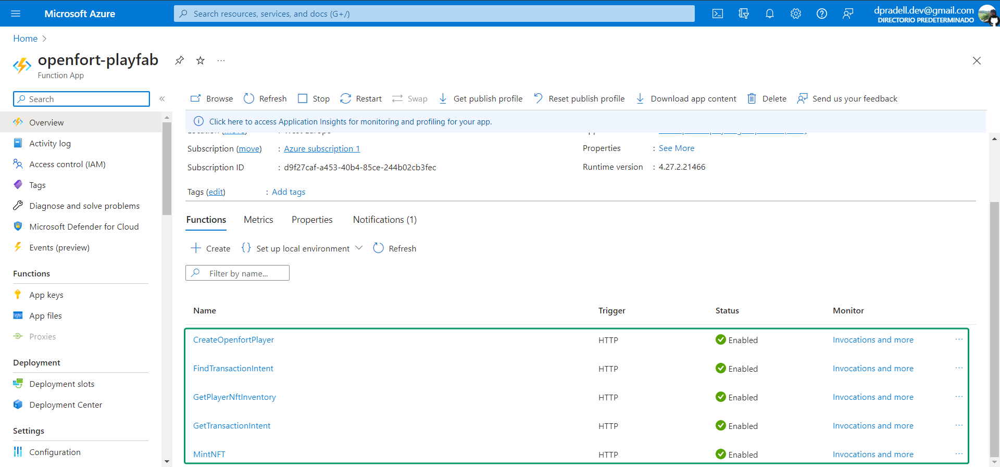

Click on any function and select ***Get Function Url***:

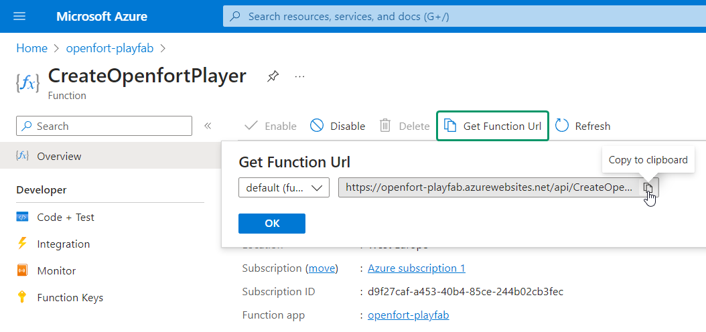

Subsequently, add this URL (along with all others) to PlayFab to enable access to our Azure Functions from within PlayFab.

## Set up PlayFab Title

1. #### Register Azure Functions
    Visit the [PlayFab developer dashboard](https://developer.playfab.com/), choose your title, and click on ***Automation***:

    

    Our functions are already registered. To do the same, click ***Register function*** and provide the function name along with its URL:

    

    Repeat this for all deployed functions.

2. #### Install Google Add-on
    Navigate to ***Add-ons*** and choose ***Google***:

    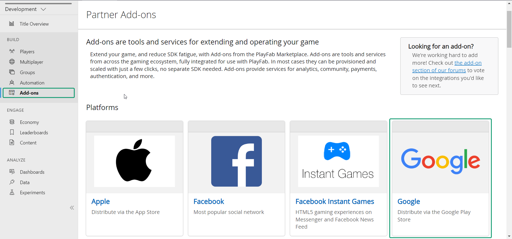

    Then, visit the [Google Cloud APIs Credentials dashboard](https://console.cloud.google.com/apis/credentials) and click on the arrow icon next to your ***OAuth Web Application Client***:

    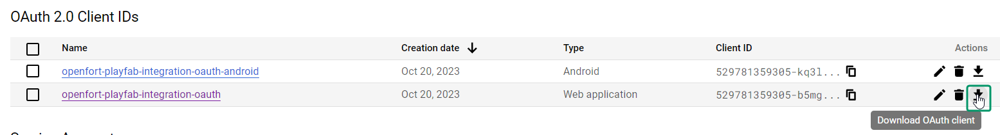

    Copy both the ***Client ID*** and ***Client Secret***:

    

    Return to the PlayFab dashboard, paste these details into the ***Google OAuth Client ID*** and ***Google OAuth Client Secret*** fields, and click ***Install Google***:

    

3. #### Add PlayFab OAuth Redirect URL
    For this, go to the [Google Cloud APIs Credentials dashboard](https://console.cloud.google.com/apis/credentials). Here, select your *Web application*:

    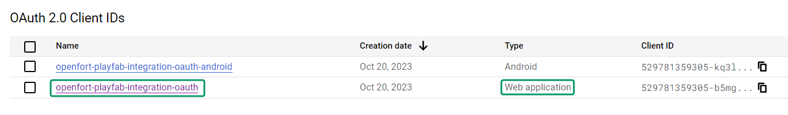

    In the ***Authorized redirect URIs*** section, add the URL below and click ***Save***:
    ```
    https://oauth.playfab.com/oauth2/google
    ```
    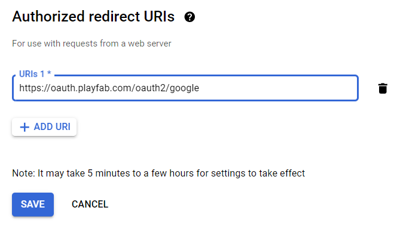

## Set up Azure Backend

Our Azure backend requires environment variables from both PlayFab and Openfort. Let's configure them.

1. #### Add Openfort Environment Variables
    - Navigate to the [Azure Portal](https://portal.azure.com/#home) and select your Function App.
    - Under ***Configuration***, click ***New application setting***:
      
      

    - Provide the following details:
      + Name: `OF_API_KEY`
      + Value: [Retrieve the **Secret key**](https://dashboard.openfort.xyz/apikeys)

    - Add another application setting:
      + Name: `OF_NFT_CONTRACT`
      + Value: [Retrieve the **Contract API ID**](https://dashboard.openfort.xyz/assets)

    - And another:
      + Name: `OF_SPONSOR_POLICY`
      + Value: [Retrieve the **Policy API ID**](https://dashboard.openfort.xyz/policies)

    After adding these, your configuration panel should resemble the following. Click ***Save***:
    
    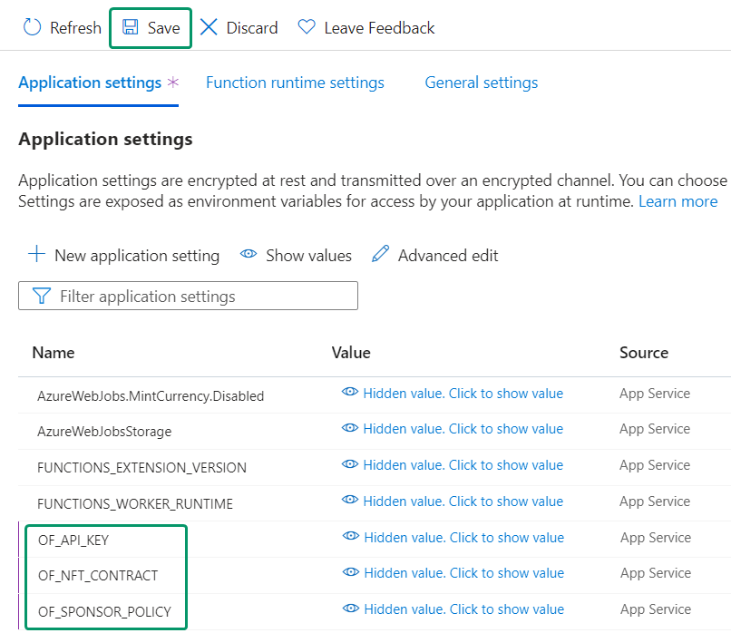

2. #### Add PlayFab Environment Variables
    - Visit the [PlayFab developer dashboard](https://developer.playfab.com/), select your title, and navigate to ***Settings wheel --> Title settings***:

      

    - In the ***API Features*** section, copy your ***Title ID***:

      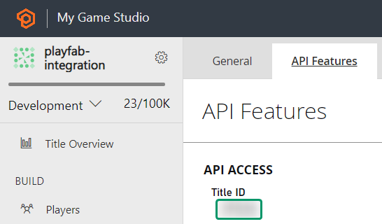

    - Under ***Secret Keys***, note down your ***Secret key***:

      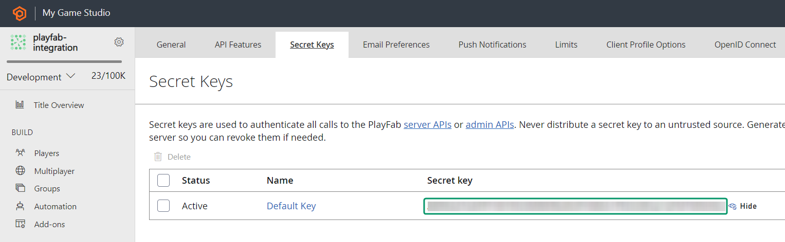

    - Return to the [Azure Portal](https://portal.azure.com/#home) and choose your Function App.
    - Under ***Configuration***, select ***New application setting*** and input:
      + Name: `PLAYFAB_TITLE_ID`
      + Value: [Your Title ID]

    - Add another application setting:
      + Name: `PLAYFAB_SECRET_KEY`
      + Value: [Your Secret Key]

    Your configuration panel should now look like the following. Confirm your changes by clicking ***Save***:

    

## Set up Unity Client

This Unity sample project is already equipped with:
+ [PlayFab Unity SDK](https://github.com/PlayFab/UnitySDK)
+ [Google Play Games Unity Plugin (v11.01)](https://github.com/playgameservices/play-games-plugin-for-unity)

To begin, open [unity-client](https://github.com/dpradell-dev/openfort-playfab-unity-sample/tree/main/unity-client) with Unity:

1. #### Configure PlayFab SDK
    - Navigate to the ***Project*** tab.
    - Search for `PlayFabSharedSettings` and input your PlayFab ***Title ID***:

      

2. #### Configure Google Play Games SDK
    - Even if you've set up the Google Play Games SDK following the [required tutorial](//TODOlink), ensure that you've correctly configured all fields by navigating to ***Window --> Google Play Games --> Setup --> Android setup***:

      
      
      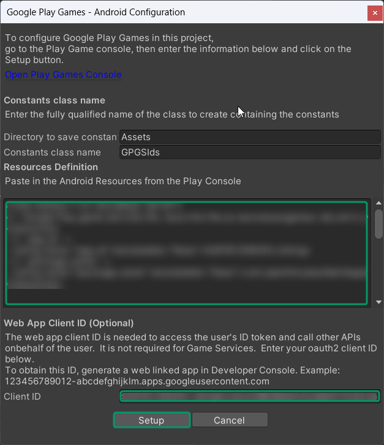

    By doing this, when the game runs on Android, it will utilize Google Play Games for user authentication via PlayFab. Otherwise, the default PlayFab authentication will be used.

## Test in Editor

Play ***Login*** scene, opt for ***Register***, provide an email and password, then click ***Register*** again. This scene should appear:

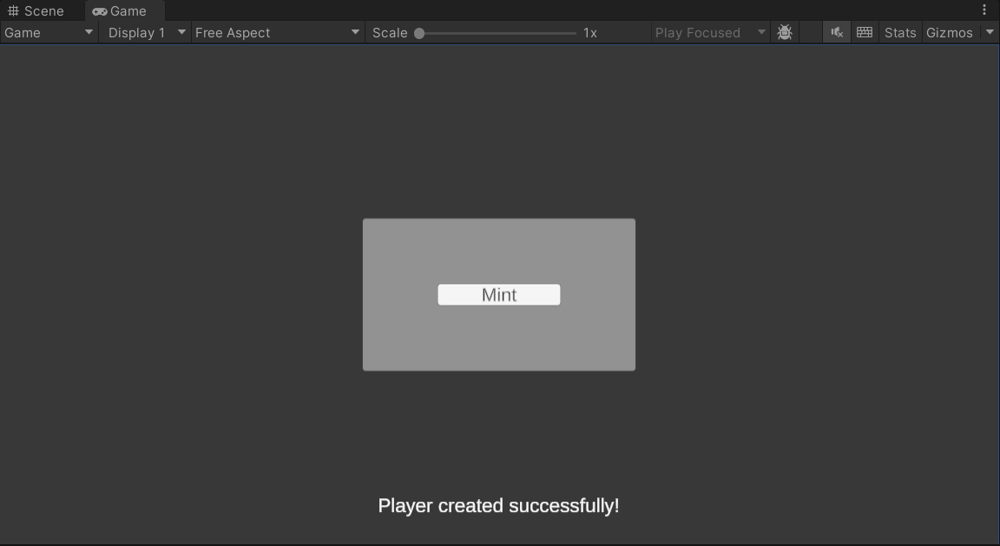

Select ***Mint***. After a brief period, you should see a representation of your newly minted NFT:

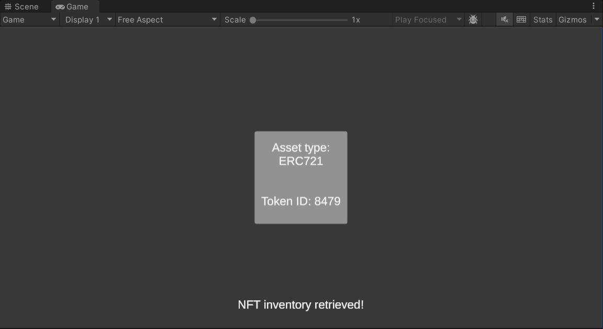

In the [Openfort Players dashboard](https://dashboard.openfort.xyz/players), a new player entry should be visible. On selecting this player:

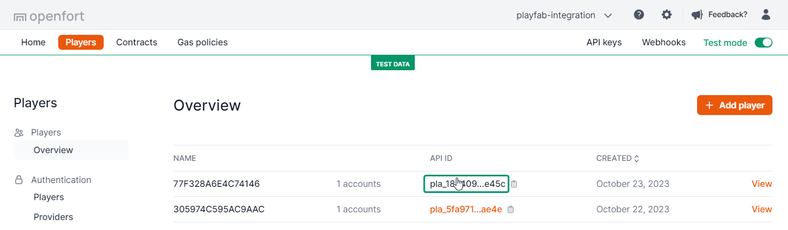

You'll notice that a `mint` transaction has been successfully processed:

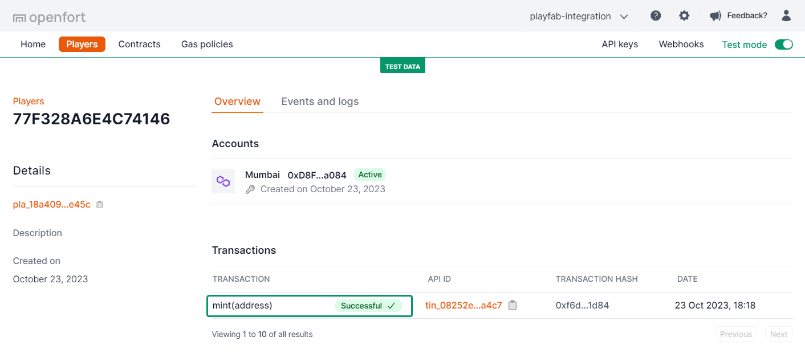

Additionally, by choosing your **Mumbai Account** and viewing ***ERC-721 Token Txns***, the transaction is further confirmed:

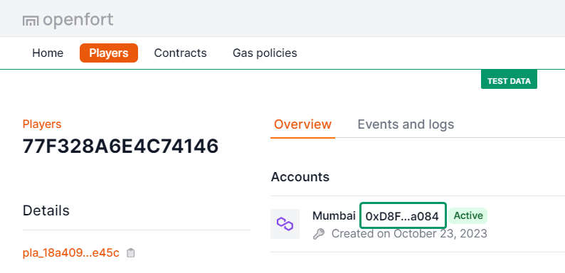

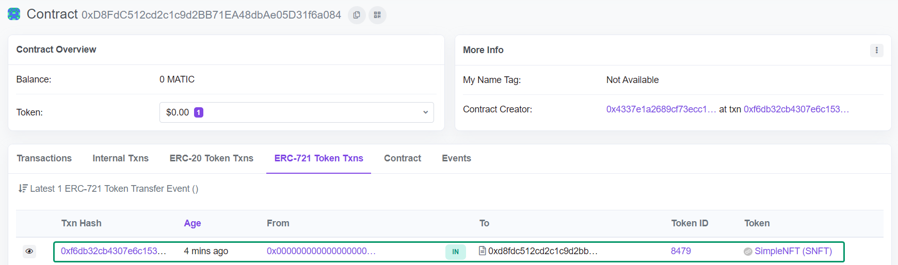

## Test on Android

Upon building and running the game on an Android device, the registration/login process is automated via Google Play Games, resulting in a streamlined user experience.

## Conclusion

Upon completing the above steps, your Unity game will be fully integrated with Openfort and PlayFab. Always remember to test every feature before deploying to guarantee a flawless player experience.

For a deeper understanding of the underlying processes, stay tuned for the [upcoming tutorial video](). For assistance or queries, consider visiting our contact or support page.